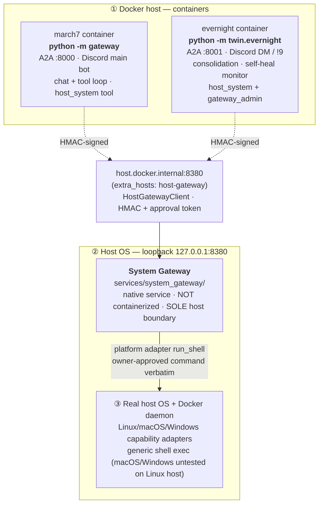

# March7 — Architecture Review

Single-source architecture overview for owner review. Grounded in the staged
tree on 2026-09-30 (Plan A staged, no deployment has occurred). For per-symbol
detail, query CodeGraph; this doc intentionally avoids file-structure dumps.

Related docs (read alongside, not duplicated here):

- `.agents/PROJECT_CONTEXT.md` — runtime modes, env vars, memory tiers.
- `.agents/AGENT_RULES.md` — safety invariants and verified gotchas.
- `.agents/DEBT.md` — open debt (DEBT-001/002 stay open; journal/overall acceptance pending).
- `docker/ARCHITECTURE.md` — Docker ownership map.
- `services/system_gateway/README.md` — threat model, API, env vars, runbook.

Historical only (do not treat as current truth): `.agents/plans/archive/system-gateway*.md`,
`.agents/notes/system-gateway-debug-verification.md` (June verification; partly
superseded by Plan A distinct approval key + durable ledger).

## 1. System Map

March7 is a two-agent Discord/A2A stack with a native host boundary. Three
trust domains:



Peer RPC between agents is signed A2A (`twin/shared/a2a/auth.py`: `X-A2A-*`
HMAC over actor + method + path + timestamp + nonce + body hash; no unsigned
bypass). Streaming additionally requires exactly one `event: complete` with
`message_count` matching received normal frames, clean EOF and final `COMPLETED`
status. Task status alone cannot prove complete delivery. **Upgrade March7 and
Evernight together**: the new client rejects markerless old-server streams;
there is no permissive legacy fallback. Muse approved this scope; nothing deployed.
There is no direct privileged BashExecutor/DockerSocket fallback and
no auto-mint: host execution goes only through System Gateway with an
owner-signed grant.

Two gateways, do not confuse them:

- **March7 A2A Gateway** (`gateway/`) — platform adapter orchestration and
  routing. Containerized. Owns the Discord bot, the unified message contract,
  and the March7 A2A server on port 8000. This is the *chat* gateway.
- **System Gateway** (`services/system_gateway/`) — native host service on
  port 8380. This is the *host OS* gateway: the only process allowed to
  execute commands on the real operating system. Containerized agents reach
  it over `host.docker.internal:8380`.

## 2. The Two Agents

### March7 (`twin/march7/`, prod entry `gateway/__main__.py`)

Primary public chat agent. Production entry is `python -m gateway`
(`gateway/__main__.py`), which owns container init, the A2A server on port
8000, and the Discord adapter via `ChatGateway`. `twin/march7/__main__.py` is
a thinner local-dev entry (no Discord). The agent loop is
`Think(Decide) → Think(Refine) → Act → … → Think(Decide)` in
`twin/shared/agent/agent_loop.py`: only `Think` stages touch the LLM; `Act`
is pure tool execution with no persona and no LLM access. `Think(Decide)`
either answers the user directly or selects the next tool, while
`Think(Refine)` remains the mandatory selected-tool validation pass before
execution (may route to a prerequisite tool when required args are missing).
Refine cancellation/error and loop-limit exits ask a final
`Think(Decide)` pass with native tools disabled; there is no separate Resolve
stage.

March7 holds only the gateway request-signing key. It requests owner approval
and consumes grants; it never mints approvals
(`twin/shared/tools/modules/system/host_system_tool.py`).

### Evernight (`twin/evernight/`, entry `twin/evernight/__main__.py`)

Background consolidation and self-heal agent. Independent Discord surface:
DMs and `!9` prefix, A2A server on port 8001. Owns:

- Inactivity-triggered consolidation: `InactivityTrigger` detects idle scopes;
  March7 ships its own T1 entries via `ConsolidationClient` to Evernight:8001;
  Evernight runs `ConsolidateMemoryTool` on the shipped entries.
- Owner approval delivery for host actions (DM approval backend) and the
  owner-trusted approval issuer (`twin/evernight/server/approval_issuer.py`).
  Only the configured owner (`EVERNIGHT_OWNER_USER_ID`) approves; non-owner
  requesters may trigger a request, never approve. Missing owner/key fails closed.
- `GatewayMonitor` + `SelfHealMonitor` — polls March7 `/health` (not the agent
  card) and the native gateway; container restart goes through owner-approved
  generic shell (`docker restart <allowed>`, allow-list checked), not a
  structured action.
- `gateway_admin` tool (Evernight-only, owner-gated) for gateway `status` /
  `doctor` / `install_hint` / `update`.

Evernight must reach March7 session state through A2A skills
(`get_snapshot`, `clear_session`); it must not read or clear March7 T1 Redis keys
directly.

## 3. Memory Tiers (shared)

All memory source lives once under `twin/shared/memory/`. Both agents build
the shared stack in their own container.

- **T1 Active** — Redis JSON, scoped `user` or `channel` (`active:{scope}:{scope_id}:{entry_id}`
  plus state/index keys). Observe/trim are Lua-atomic (entry+index+tokens
  linearize on Redis); trigger dispatch is bounded (in-progress guard +
  cooldown). Cold archive uses per-day Redis lists with TTL, best-effort.
  Consolidation archives only validated deleted snapshots after successful
  guarded trim; ordinary trim archives before deletion. A crash between
  consolidation trim and archive can lose the cold copy; archive failure does
  not undo/block trim. Required T2/T3 writes must already be ACKed.
- **T2 Timeline** — Redis Stack HASH (`timeline:summary`) with RediSearch
  `VECTOR HNSW FLOAT32 COSINE DIM=640`. Only backend is local Harrier q4 ONNX
  (`HarrierEmbeddingService`, dim `640`, pull via `scripts/pull_harrier_model.py`).
  Recall is tool-only: `SharedMemoryManager.get_context` returns T1+T3 only;
  the model calls `search_memory` (`user_id`, optional `channel_id` dual-scope,
  optional `query`/`days_back`, `limit`). Gates: `T2_MIN_COSINE` default `0.60`,
  `T2_MERGE_MIN_COSINE` default `0.75` (Harrier-calibrated 2026-09-30; legacy
  Qwen-era overrides warn but are respected). Diary vectors validate dim/finite
  and fail closed (BM25-only invalid vectors are dropped, never bypass the floor).
  Same-day merge is CAS with recompute-from-fresh-read on conflict. Requires
  `TIMELINE_REDIS_DB=0`. Dim change uses staged migration
  (`scripts/migrate_t2_harrier.py` dry-run + verified backup + resumable re-embed
  from source HASH `summary`, only `embedding` rewritten, never `DEL`/`FLUSHALL`/`DD`,
  never pad/truncate legacy 1024 vectors; `--recreate-index` only after validation
  with `DROPINDEX` without `DD`). Additive fields (`day`/`period_start`/`period_end`)
  use `FT.ALTER` without reindexing. Production migration is a manual owner action
  with explicit backup; no production data deletion.
- **T3 Profile** — Markdown files via `MarkdownProfileStore`, default base
  `memories/`, 8 fixed sections. Writes are CAS on `expected_profile_hash` with
  recompute-on-drift (never bless stale rewrites); whole-file mode deletes
  unspecified sections and guards >50% shrink unless `allow_shrink=true`.
  The durable core memory; T1/T2 may be disposable in dev but T3 must not be
  deleted without confirmation.

A2A Consolidation flow: `InactivityTrigger` (Evernight) detects idle scopes →
March7 ships T1 entries via `ConsolidationClient` to Evernight:8001 → Evernight
runs `ConsolidateMemoryTool`, summarizing shipped entries into
`TimelineSummaryStore` / `MarkdownProfileStore` in one LLM call → March7 trims
only on a fully successful whole-batch ACK (non-empty exact pinned `entry_ids`,
zero failed/conflict required writes, no foreign/duplicate IDs, non-zero durable
writes and a receiver-generation receipt for meaningful content). Channel-scope
consolidation stores T2 under `user_id=channel_id` and skips T3.

Caller journal lives in its own T1 DB; receiver ownership/plan lives in shared
timeline Redis. The caller pins ordered IDs and SHA256 full-provenance hashes
before dispatch; retries exact-fetch that batch rather than a moving last-200
window. Journals do not copy raw transcripts. Pending ownership/batch/plan has
**no expiry**: failed or zero-store attempts never release it. Successful ACK is
journaled; a single OwnT1 Lua validates caller nonce/identity and the exact T1
snapshot, trims, and records `trimmed`. Post-trim retries release only matching
receiver generation, then clear only matching caller nonce, without redoing LLM
or reading deleted entries. Completed plans receive a fresh 365-day TTL after
trim/release. Both agents must upgrade together; old receipts are rejected.

Reset clears only own caller/T1 state, not receiver witnesses: partial T2/T3
writes may already exist. Pending metadata and derived plans can persist
indefinitely and remain sensitive. For stuck/unrecoverable scopes, quiesce the
affected writers, back up T1/T2/T3 and journal records, restore exact provenance
from an audited backup or reconcile committed writes before owner-authorized
manual cleanup. There is no automatic GC/admin-release shortcut; deleting
witnesses can allow duplicate writes. Joint journal/plan loss is undetectable;
Redis crash/OOM and cross-DB races still require explicit recovery assumptions.
See `.agents/DEBT.md`; no production recovery/migration was performed.

## 4. Tool Runtime

Declared logical tools have two backend kinds:

- `local` — direct `BaseTool` / `ToolRegistry` execution for in-process tools
  and app-owned services.
- `remote_mcp` — external MCP servers outside the trust boundary, called
  through `MCPClient` only when a real integration exists. Currently only
  `web_search` (Tavily remote MCP). Remote `tools/list` metadata is untrusted and must
  never be rendered into the system prompt, lazy guide, or native tool
  schema descriptions.

The prompt contract stays local: `ToolPromptCatalog`, guide files under
`twin/shared/tools/prompts/guides/`, local schema descriptions, visibility,
and approval are the model-facing source of truth.

Host interaction tools:

- `host_system` — the model-facing tool that talks to System Gateway via
  `HostGatewayClient`. Modes: `capabilities`, `shell`.
- `gateway_admin` — Evernight-only, owner-gated, for gateway administration
  (`status` / `doctor` / `install_hint` / `update`).

## 5. System Gateway — Host Boundary

The host OS boundary. Runs native on the host (not in Docker), binds to
`127.0.0.1:8380` in foreground defaults. Bootstrap instead defaults to
`0.0.0.0` if `SYSTEM_GATEWAY_HOST` is unset: configure trusted bind/firewall
before installation; actual firewall behavior is unverified. Containers reach it via
`SYSTEM_GATEWAY_URL=http://host.docker.internal:8380` and sign requests with
`SYSTEM_GATEWAY_SHARED_SECRET`. The private approval key is a DIFFERENT
credential, held only in a host-private FILE and mounted read-only into
Evernight alone; equal credentials are rejected and missing owner/key fails
closed. Plan A is staged; no deployment has occurred.

### 5.1 Components

- **Native service** `services/system_gateway/` — aiohttp server, config
  (`config.py`: distinct keys, equal rejected), durable ledger
  (`approval_ledger.py`: stdlib SQLite, `:memory:` test-only), in-memory state
  (`state.py`), CLI (`cli/`), platform packaging
  (`packaging/{linux,macos,windows}/`).
- **Shared agent-side library** `twin/shared/system_gateway/` —
  `auth.py` (HMAC sign/verify, `canonical_approval_action` /
  `mint_approval_token` / `verify_approval_token`),
  `policy.py` (default-deny evaluation), `audit.py` (audit event schema),
  `client.py` (`HostGatewayClient`), `types.py` / `errors.py`.
- **Platform adapters** `services/system_gateway/adapters/` —
  `base.py` (interface + `run_shell`), `linux.py` / `macos.py` / `windows.py`
  capability reporting with generic shell exec (`/bin/bash`, `/bin/zsh`,
  `powershell.exe`; macOS/Windows untested on this Linux host).
- **Evernight host-gateway orchestration** `twin/evernight/host_gateway/` —
  `monitor.py` (`GatewayMonitor`, `request_container_restart`),
  `installer.py` (bootstrap hint + `InstallerCoordinator`).
- **Owner-trusted issuer** `twin/evernight/server/approval_issuer.py` —
  reads the approval key from its host-private file only; March7 must never
  import it.

### 5.2 API Surface

| Method | Path | Auth | Purpose |
|--------|------|------|---------|
| `GET`  | `/health`        | none            | version, status, uptime, platform |
| `GET`  | `/capabilities`  | none            | platform, shells, features, raw-shell policy |
| `POST` | `/shell/run`     | HMAC + approval | owner-approved shell command |
| `POST` | `/self/update`   | HMAC + approval | record owner-approved update request (no auto-download) |

### 5.3 Authentication — HMAC-SHA256

Every mutating request is signed with the request key. Canonical message
(`twin/shared/system_gateway/auth.py`):

```text
METHOD\nPATH\nTIMESTAMP\nNONCE\nACTOR\n<sha256(body)>
```

- Timestamp is **seconds** (`str(int(time.time()))`), max clock skew
  `DEFAULT_MAX_CLOCK_SKEW_SECONDS = 300`.
- Nonces are tracked in `NonceStore` with TTL eviction (replay protection).
- The client serializes the body itself (`jsonlib.dumps(..., separators=(",",":"))`)
  so the signed bytes match `request.read()` exactly — letting aiohttp
  re-serialize would break the signature.

### 5.4 Approval Tokens — action-bound, single-use, durable

After the owner approves a host action, the owner-trusted issuer mints a compact
approval token (`mint_approval_token` with the separate approval key) that binds:

- token version, issued_at, short expiry,
- a fresh nonce (the single-use replay key),
- the actor (e.g. `march7` or `evernight`),
- `canonical_approval_action(...)` — command/shell/cwd/timeout (or self.update
  versions), not just the action name.

Format: `<urlsafe-b64(payload-json)>.<hex-signature>`, HMAC-SHA256 with the
approval key (never the request key).

The server verifies the token (`verify_approval_token` with the approval key),
checking signature, expiry, action match, and actor match, and rejects equal
request/approval credentials before verification. It then claims the nonce
durably via `GatewayState.consume_approval` → SQLite `ApprovalLedger.claim`
(scoped by approval-key fingerprint). Ledger missing/unwritable fails closed
(deny, never execute); there is no in-memory fallback and no silent memory set.

### 5.5 Policy — default-deny

`evaluate_shell_policy` / `evaluate_action_policy` (`policy.py`):

- Raw shell is denied unless `SYSTEM_GATEWAY_RAW_SHELL=true`, and still
  requires a valid approval token.
- Missing approval → `APPROVAL_REQUIRED`; replayed approval id → `APPROVAL_REPLAYED`.

### 5.6 Generic Shell Path

`POST /shell/run` executes exactly the owner-approved command after HMAC and
approval-token verification. Generic shell is the only execution path
(`structured_actions == []`). The tool-facing guardrail is `host_system`:
it requests capabilities first when needed, asks `ApprovalGate` with the raw
command text, receives an owner-signed grant from the Evernight issuer, and
then calls the gateway. March7 never mints.

### 5.7 Self-Update Hook

`POST /self/update` validates a `self.update`-bound approval token (approval key),
checks `from_version` against `SERVICE_VERSION` (returns 409 `version_mismatch` if
mismatched), durably claims the nonce, records the request, and returns a queued
status. It does **not** auto-download or restart; the admin applies the package
update out-of-band.

## 6. Approval Flow — End-to-End

```mermaid
flowchart TD
    U["User asks for a host action in Discord"]
    T["March7 <b>host_system</b> tool, mode=shell"]
    AG["ApprovalGate.authorize_host(action, actor, execution fields)<br/>→ Evernight owner DM<br/>issuer canonicalizes effective fields before prompting"]
    U --> T --> AG
    AG -->|owner clicks Approve<br/>(interaction_check owner-only + re-verify)| OK["Owner consent to exact effective action"]
    AG -->|non-owner click / Reject / timeout| NO["decision.approved = False<br/>no grant, no native execution"]

    OK --> MINT["Evernight <b>approval_issuer</b> mints grant<br/>canonical action + actor + expiry + nonce<br/>authorize_host returns decision.grant; shared tools never mint"]
    MINT --> CALL["HostGatewayClient.run_shell(<br/>GatewayShellRequest(approval_id=grant, …))<br/>HMAC-signed POST /shell/run"]
    CALL --> SRV

    subgraph SRV["System Gateway server — defense-in-depth"]
        direction TB
        A1["auth_middleware<br/>verify HMAC signature + nonce + skew"]
        A2["reject equal request/approval credentials<br/>evaluate_action_policy"]
        A3["verify_approval_token (approval key)<br/>signature · expiry · action match · actor match"]
        A4["consume_approval(nonce)<br/>durable SQLite ledger claim"]
        A1 --> A2 --> A3 --> A4
    end

    A4 --> EXEC["adapter executes<br/>owner-approved command verbatim"]
    EXEC --> AUD["audit event + response<br/>→ back to March7 → Discord"]
```

Defense-in-depth: the owner approves once (Discord button, owner-only), the
owner-trusted issuer mints an action-bound grant, and the server re-verifies
with the separate approval key and durably consumes it. A compromised requester
that steals a grant for action A cannot replay it for action B or reuse it for
action A a second time. Non-owner may request; only the configured owner approves.

## 7. Security Model & Threat Surface

Trust boundary: System Gateway is the only process that executes host
commands. Containers must never shell out to the host directly, through
Redis, the Docker socket, or any side channel. `AGENT_RULES.md` codifies
this as a non-negotiable invariant. No auto-mint: March7 requests/consumes,
only the Evernight issuer (+ owner CLI on the host) signs.

Staged strengths (Plan A, no deployment yet):

- **Default-deny is real.** Shell requests need an owner-signed grant; there is no
  read-only exception for host execution.
- **Token binding is real.** Canonical-action-bound + actor-bound + expiry +
  durable single-use (SQLite ledger, key-fingerprint scoped). Equal request/approval
  credentials are rejected; missing key fails closed.
- **Keys are separated.** Request HMAC uses `SYSTEM_GATEWAY_SHARED_SECRET`;
  approvals use the host-private FILE mounted read-only into Evernight only.
  March7 blanks approval vars and never mounts the key.
- **HMAC canonical + skew** is correct (`auth.py`, skew 300s, timestamp in seconds,
  `NonceStore` TTL eviction).
- **Shell execution is approval-bound.** The approved command text is shown to
  the owner before the issuer mints the single-use grant.
- **Network exposure** is loopback for foreground defaults; owner bootstrap
  defaults to all interfaces when the host setting is absent. Configure bind
  and firewall explicitly; host network isolation is not verified by unit tests.
- **Mounts** are least-privilege: source `:ro`, own persona overlay writable,
  `memories/`+`data/` writable, `models/` `:ro`; owner-absent boot denies
  approval/DM without crashing.

Open gaps (staged notes, not resolved — see `.agents/DEBT.md`):

1. **Channel/button approval hardening is staged, not verified live (DEBT-001).**
   `ApproveView.interaction_check` + re-verify in callbacks now restrict clicks to
   the configured owner (non-owner gets ephemeral deny); `DMApproveView` inherits it.
   DEBT-001 stays open pending live verification and overall acceptance.
2. **Audit log is in-memory only.** `GatewayState.record_audit`
   appends to a `list` capped at 500 entries and logs a redacted line (approval IDs
   never hit the log stream). Restart loses history; a busy gateway evicts old entries.
   For a host boundary service this is a forensics gap.
3. **`EVENT_APPROVAL_REQUESTED` is defined but never emitted.**
   `audit.py` declares it; no code path emits it. The audit trail records denials,
   starts, completions, and timeouts, but not the moment an approval was requested.
4. **`install_hint` must come from the tool, not the model.** The real hint is
   `gateway_admin install` → `cd <verified-repo>` + `python3 scripts/bootstrap_system_gateway.py`
   (owns secret sync, venv, package install, service install, restart, health check).
   Treat any `npx`/`pip install system-gateway` output or invented manual
   `pip`/`systemctl` sequences from the model as a hallucination. Repo path is shown
   only when `SYSTEM_GATEWAY_BOOTSTRAP_REPO_ROOT` verifies markers; otherwise the hint
   uses placeholder `/path/to/march7`.
5. **A2A resource bounds are in-progress (DEBT-002).** Task lifecycle is bounded
   in-memory (active/completed caps, buffer/subscriber bounds, TTL/purge) with tests
   in `tests/unit/a2a_task_bounds_test.py`; rich status/doctor skills are not staged.
   Verify code; do not assume completeness.

## 8. Docker Stack

Master compose: `docker/docker-compose.yml` includes per-ownership files.

| Service | Compose | Owner | Boundary |
|---------|---------|-------|----------|
| `redis`     | `shared/`           | shared  | T1 + T2 memory (DB 0 for T2 index) |
| `codebox`   | `shared/`           | shared  | sandboxed Python execution, port 8069 |
| `march7`    | `march7/`           | March7  | A2A `:8000`, Discord main bot, `python -m gateway` |
| `evernight` | `evernight/`        | Evernight | A2A `:8001`, Discord DM/`!9` bot, `python -m twin.evernight` |
| `system-gateway` | (native, not in compose) | host | `127.0.0.1:8380` |

Both `march7` and `evernight` carry `extra_hosts: host.docker.internal:host-gateway`
and `SYSTEM_GATEWAY_URL=http://host.docker.internal:8380` +
`SYSTEM_GATEWAY_SHARED_SECRET` from common `env_file: ../../.env` (no `.env` bind).
Peer credential isolation uses explicit blank overrides (`DISCORD_EVERNIGHT_TOKEN=`
in March7, `DISCORD_MARCH7_TOKEN=` in Evernight; March7 also blanks approval vars).
The approval-key FILE is mounted read-only into Evernight only
(`target: /run/secrets/system_gateway_approval`, `read_only: true`,
`bind.create_host_path: false`, `selinux: z`; host source
`${SYSTEM_GATEWAY_APPROVAL_SECRET_HOST_PATH:-${HOME}/.config/system-gateway/approval_secret}`).
Source mounts (`twin/`, `gateway/`, `models/`) are `:ro`; only the agent's OWN
persona dir is a writable data-only overlay (`.md`, peer stays read-only);
`memories/` + `data/` are writable. The System Gateway itself is not
a Docker service — it runs on the host via systemd/launchd and is reached
through the host-gateway mapping.

Startup:

```bash
docker compose -f docker/docker-compose.yml up -d --build
docker compose -f docker/docker-compose.yml ps
# Native gateway (separate, owner-installed):
curl -sf http://localhost:8380/health
```

## 9. Operational Notes

- **March7 container entry is `python -m gateway`**, not
  `python -m twin.march7`. When wiring March7 background tasks, add them to
  `gateway/__main__.py`; `twin/march7/__main__.py` is a thinner local-dev
  entry.
- **Host-bound endpoints use `host.docker.internal`, never `localhost`.**
  Inside a container, `localhost` resolves to the container itself and
  fails. Applies to LLM endpoints and `SYSTEM_GATEWAY_URL`. (Embeddings are
  local Harrier ONNX, not an API.)
- **Run tests through the conda env interpreter:**
  `conda run -n discord_bot python -m pytest …`, not `conda run -n discord_bot pytest …`.
  Skips (e.g. missing Harrier marker) are not proof.
- **T2 dim change uses the staged migration**, not raw index drop/restart:
  `python3 scripts/migrate_t2_harrier.py ...` (dry-run by default without
  `--apply`/`--rollback`; no `--dry-run` flag) then `--apply --backup PATH` (verified backup + resumable re-embed, only `embedding`
  rewritten; `--recreate-index` only after validation, `DROPINDEX` without `DD`).
  Additive fields use `FT.ALTER`. Production migration/redeploy is a manual owner
  action with explicit backup; no production data deletion.
- **No production deployment has occurred** for staged Plan A. Owner recreates
  containers manually after `.env` changes
  (`up -d --force-recreate march7 evernight`); no rebuild unless deps/Dockerfile change.

## 10. Open Items Tracked Elsewhere

- `tests/unit/system_gateway_adapter_test.py` (TASK-027) — missing-executable,
  timeout, truncation, unauthorized-approver cases only partially covered.
- Channel-button approver restriction (TASK-026, staged `interaction_check`, still open — DEBT-001).
- `EVENT_APPROVAL_REQUESTED` emission (TASK-045, partial).
- Audit log persistence (no task yet — flagged in §7.2).
- A2A resource bounds + rich status/doctor skills (in-progress — DEBT-002).
- Zalo adapter: planned, not implemented (`factory.py` raises `NotImplementedError`).
- No blanket 37-findings verdict. Sol exhausted quota without a verdict;
  Muse approved SSE/recall and final targeted journal closeout/source/docs.
  Coordinated application remains pending; DEBT-001/002 stay open.
