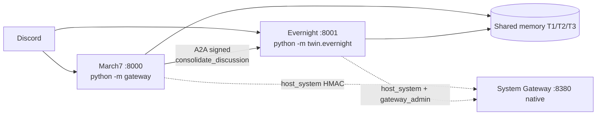

# Bé Bảy (March7) — Twin-Soul AI Assistant for Discord

Bé Bảy là hệ Twin-Soul trên Discord: `march7` chat chính + tool calling, `evernight` chat riêng DM/tag/`!9` + consolidation, notification/approval, self-heal. Hai agent giao tiếp qua A2A ký HMAC.

## Tính năng chính

- Discord AI assistant hội thoại + tool calling.
- Twin-Soul: `march7` (:8000) chat chính, `evernight` (:8001) chat riêng + tác vụ nền.
- Memory 3 tầng local-first: T1 Redis, T2 vector Harrier, T3 Markdown.
- Consolidation A2A + self-heal monitor.
- Host boundary duy nhất: System Gateway native + owner approval.

Agent workflow (CodeGraph + skills) và boundary: bắt đầu từ [.agents/README.md](.agents/README.md).

## Kiến trúc tổng quan



| Agent | Boot | Vai trò |
|---|---|---|
| March7 | `python -m gateway` | Chat chính, tool loop, A2A :8000 |
| Evernight | `python -m twin.evernight` | DM/`!9`, approval DM, consolidation, self-heal, A2A :8001 |

Discord chỉ là adapter; core agent/memory/tool/approval không phụ thuộc object Discord. Chi tiết: [ARCHITECTURE.md](ARCHITECTURE.md), [.agents/PROJECT_CONTEXT.md](.agents/PROJECT_CONTEXT.md).

### Memory 3 tầng

- **T1 active:** Redis JSON theo scope user/channel, observe/trim nguyên tử Lua, trigger bounded.
- **T2 timeline:** Redis Stack `VECTOR HNSW DIM=640`, Harrier q4 ONNX duy nhất, recall tool-only qua `search_memory` (`get_context` chỉ T1+T3), gate `T2_MIN_COSINE=0.60`, merge `T2_MERGE_MIN_COSINE=0.75`, merge CAS.
- **T3 profile:** Markdown 8 section, CAS `expected_profile_hash`, inject system prompt mỗi turn.
- **Vòng đời A2A:** Evernight `InactivityTrigger` phát hiện idle → March7 ship T1 qua A2A → Evernight `ConsolidateMemoryTool` ghi T2/T3 → March7 trim theo `entry_ids` khi ack fully ok.

### Host boundary — System Gateway (Plan A, staged, chưa deploy)

System Gateway là boundary host DUY NHẤT: native trên host, container gọi qua `SYSTEM_GATEWAY_URL` + HMAC. Foreground mặc định `127.0.0.1:8380`, nhưng bootstrap mặc định `0.0.0.0` khi chưa đặt `SYSTEM_GATEWAY_HOST`: phải cấu hình bind/firewall cho mạng tin cậy trước khi cài. Chưa kiểm chứng firewall thực tế. Không fallback BashExecutor/DockerSocket trực tiếp, không auto-mint.

- Evernight owner DM/UI là trusted issuer duy nhất; March7 chỉ request + consume grant, không sign. Chỉ configured owner (`EVERNIGHT_OWNER_USER_ID`) approve; non-owner được request, không bao giờ approve. Missing owner/key fails closed (deny, không fallback).
- Request-HMAC key `SYSTEM_GATEWAY_SHARED_SECRET` KHÁC private approval key FILE. Approval value chỉ ở host-private FILE ngoài repo, mount read-only vào Evernight duy nhất (`/run/secrets/system_gateway_approval`); secrets không nằm trong shared `.env`/repo. Equal credentials bị reject.
- Grant là owner-signed structured token (`canonical_approval_action` + `mint/verify_approval_token`) bound canonical execution + actor + expiry + durable single use (SQLite ledger + nonce). Bare approval ID không đủ.
- Native generic shell là path duy nhất; raw shell denied by default (`SYSTEM_GATEWAY_RAW_SHELL=false`) và vẫn cần grant khi bật.
- Source `twin/`+`gateway/`+`models/` `:ro`; chỉ OWN persona overlay writable; `memories/`+`data/` writable; owner-absent boot deny không crash.
- Install/update do owner chạy thủ công (`gateway_admin install` → `scripts/bootstrap_system_gateway.py`); agent không tự cài từ Docker. Chi tiết: [services/system_gateway/README.md](services/system_gateway/README.md).

## Prerequisites

- Python `3.11+`, Docker + Compose v2, Discord bot token(s) + LLM endpoint/key.

## Quick start

```bash
cd docker
docker compose down
DOCKER_BUILDKIT=1 docker compose build
docker compose up -d
docker compose logs -f
```

Local: `pip install -r requirements.txt`, rồi `python -m gateway` (March7) hoặc `python -m twin.evernight` (Evernight). Health: `:8000/health`, `:8001/health` (503 khi Discord chưa connected); A2A card: cùng port `/.well-known/agent.json`. Chi tiết: [docker/README.md](docker/README.md).

> [!IMPORTANT]
> Entrypoint gọi `load_dotenv(override=True)` nếu tìm thấy file `.env`. Compose chỉ inject `env_file` và explicit peer-credential blank overrides, **không bind/copy `.env` vào container**: file đó có thể đè các blank overrides, phá isolation. Sau khi owner đổi cấu hình, recreate: `docker compose -f docker/docker-compose.yml up -d --force-recreate march7 evernight`.
>
> A2A streaming bắt buộc một `event: complete` với `message_count` khớp số message đã nhận, EOF sạch và final status `COMPLETED`; status riêng không chứng minh đã nhận hết output. **Nâng cấp March7 và Evernight cùng nhau**; client mới từ chối stream server cũ không có marker, không có legacy fallback. Chưa deploy.

## Cấu hình

Nhóm chính (không in giá trị thật): shared (`REDIS_URL`, `TIMELINE_REDIS_DB`, `CODEBOX_API_URL`, `SYSTEM_GATEWAY_URL`), March7/Evernight ports + DB + persona, Discord tokens, T1 budget, Harrier/T2 gates, LLM provider. Chi tiết: [.agents/PROJECT_CONTEXT.md](.agents/PROJECT_CONTEXT.md), [docker/README.md](docker/README.md), LLM/embeddings: [twin/shared/llm/README.md](twin/shared/llm/README.md).

## Migration T2 (xác nhận bắt buộc, không rút gọn)

Đổi dim KHÔNG dùng `FT.DROPINDEX`/restart thô. Dùng `python3 scripts/migrate_t2_harrier.py ...` (dry-run mặc định khi không có `--apply`/`--rollback`; parser không có flag `--dry-run`) rồi `--apply --backup PATH` (backup full HASH + SHA-256, verify trước mọi write, resumable, chỉ rewrite `embedding` từ `summary`; `--recreate-index` chỉ sau validation, `DROPINDEX` không `DD`; `--rollback --backup PATH`). KHÔNG bao giờ `DEL`/`UNLINK`/`FLUSHALL`/`DD`, KHÔNG pad/truncate vector 1024 cũ. Field additive (`day`/`period_start`/`period_end`) dùng `FT.ALTER`, không reindex. Production migration là owner action thủ công; backup trước khi migrate explicit; không xóa dữ liệu thật.

## Development & testing

```bash
pytest tests/unit/ -v
pytest tests/integration/ -v
```

Chọn test focused và service deps theo [.agents/TESTING_GUIDE.md](.agents/TESTING_GUIDE.md). Không chạy Discord/host-exec/network thật để verify docs.

## Troubleshooting

- Containers/logs: `docker compose -f docker/docker-compose.yml ps|logs -f march7 evernight`.
- LM Studio phải bind `0.0.0.0` để container gọi qua `host.docker.internal:1234`.
- Đổi embedding dim: chỉ dùng staged migration ở trên.

## Tài liệu liên quan

- [.agents/](.agents/) (start: [README.md](.agents/README.md)), [ARCHITECTURE.md](ARCHITECTURE.md)
- [services/system_gateway/README.md](services/system_gateway/README.md), [docker/README.md](docker/README.md), [twin/shared/llm/README.md](twin/shared/llm/README.md), [scripts/README.md](scripts/README.md)
