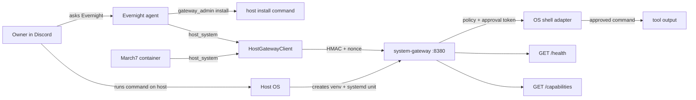

# System Gateway

Native host boundary for the Twin agent stack. `march7` and `evernight` run in
Docker, but host operations run through this service on the host OS. Agents
cannot execute host commands directly: `host_system` signs requests to System
Gateway. Generic shell execution is disabled by default; enabling it still
requires a fresh owner approval for every command.

This README describes the repo package and expected operating model. It does
not mean the service is currently installed on this host; when in doubt, ask
Evernight for `gateway_admin status` or `gateway_admin doctor`.

## Architecture

Directory ownership:

- `services/system_gateway/` is the native host service package. This is what
  gets installed into the host venv and runs as `system-gateway.service`.
- `twin/shared/system_gateway/` is shared protocol code: HMAC auth, request and
  response types, client errors, and `HostGatewayClient`.
- `twin/evernight/host_gateway/` is Evernight-side orchestration only:
  health monitor, `gateway_admin` bootstrap hints, and update requests. It is
  not a second service implementation.
- `scripts/bootstrap_system_gateway.py` is the one-command installer for the
  native service package in `services/system_gateway/`.
- March7 and Evernight use `host_system` for host operations. Evernight also
  exposes owner-only `gateway_admin` commands for status, diagnosis, install
  hints, and update requests.



First install is special: when the service is missing, there is no host
execution channel yet. Install guidance comes from Evernight's
`gateway_admin install` or `gateway_admin install_hint`, which returns a
code-generated command for the owner to run on the host. It does not execute a
container-side bootstrap bridge.

After install, normal host interaction goes through `host_system` and
`HostGatewayClient`.

## Current Capabilities

- `GET /health` reports service status, version, uptime, and platform.
- `GET /capabilities` reports platform, shell, and feature metadata.
- `POST /shell/run` runs an owner-approved command on the platform shell.
- `POST /self/update` records an owner-approved update request; it does not
  download or restart binaries by itself.

Current adapters expose one generic shell path:

| Platform | Shell | Feature |
| --- | --- | --- |
| Linux | `/bin/sh` | `generic_shell_exec` |
| macOS | `/bin/zsh` | `generic_shell_exec` |
| Windows | `powershell.exe` | `generic_shell_exec` |

## Security Model

- `/health` and `/capabilities` are public for monitoring.
- Mutating endpoints require HMAC request signing (shared request key) with
  timestamp and nonce.
- Shell execution also requires a fresh owner approval token bound to the
  canonical execution payload (`command`/`shell`/`cwd`/`timeout` via
  `canonical_approval_action`) and the request actor, verified with a
  SEPARATE owner approval key. Update requests bind `from_version`/`to_version`.
- Approval tokens are single-use via a durable host-local SQLite ledger
  (`approval_ledger.db` in the private state dir); replayed nonces are
  rejected across restarts and instances, expired rows are pruned, and
  ledger I/O failure fails closed (mutations denied, never executed).
  The ledger stores only nonce + expiry + key fingerprint, never tokens.
- Request and approval credentials must differ: equal values are rejected at
  config load and denied at the handler (no secret values in errors).
  Missing owner approval key fails closed (mutations denied, no fallback).
- Trust model (plan A): Evernight is the owner-trusted approval issuer and
  holds the approval key (via a host-private file mounted only into
  Evernight); March7 holds only the request key and consumes grants, never
  mints. The owner CLI on the host also holds the approval key.
- The Linux systemd unit runs from `/opt/system-gateway/venv/bin/python`, keeps
  `ProtectHome=true`, and reads the shared request secret from
  `/etc/system-gateway/secret` plus the approval key from
  `/etc/system-gateway/approval_secret`.
- There is no Docker privileged host executor in the default stack.

## Quick Start

### Owner-Driven Install Hint

From Discord DM with Evernight:

```text
Evernight, cài lại System Gateway bằng gateway_admin install.
Sau khi xong gọi host_system capabilities.
```

Evernight returns the exact host command. Run it on the host, then ask
Evernight or March7 for `host_system capabilities` to verify the service.

The generated command only uses `SYSTEM_GATEWAY_BOOTSTRAP_REPO_ROOT` when
Evernight can verify that path contains both
`scripts/bootstrap_system_gateway.py` and `services/system_gateway/`. If the
path is unset or not visible from Evernight's runtime, the hint falls back to
the placeholder `/path/to/march7`; replace it with the real repo root on the
host before running the command.

## Configuration

| Variable | Default | Used by |
| --- | --- | --- |
| `SYSTEM_GATEWAY_URL` | `http://host.docker.internal:8380` | containers |
| `SYSTEM_GATEWAY_HOST` | `127.0.0.1` | native service |
| `SYSTEM_GATEWAY_PORT` | `8380` | native service |
| `SYSTEM_GATEWAY_RAW_SHELL` | `false` | explicit opt-in to enable shell |
| `SYSTEM_GATEWAY_SHARED_SECRET_FILE` | `<platform-dir>/secret` | native service request key |
| `SYSTEM_GATEWAY_APPROVAL_SECRET_FILE` | `<platform-dir>/approval_secret` | native service + owner CLI approval key |
| `SYSTEM_GATEWAY_STATE_DIR` | `<platform-dir>` | native service state (ledger) |
| `SYSTEM_GATEWAY_APPROVAL_LEDGER_FILE` | `<state-dir>/approval_ledger.db` | durable single-use ledger (SQLite) |
| `SYSTEM_GATEWAY_BOOTSTRAP_REPO_ROOT` | unset | Evernight install hint |
| `SYSTEM_GATEWAY_BOOTSTRAP_VENV` | platform-specific | bootstrap script |

`services/system_gateway/paths.py` is the shared CLI/bootstrap/native source
of truth. Explicit file/state overrides win. Platform directories:

- Linux root: `/etc/system-gateway` when usable (existing root key files also
  remain preferred); non-root: `~/.config/system-gateway`.
- macOS: `~/Library/Application Support/system-gateway`.
- Windows administrator: `%ProgramData%\\system-gateway`; other users:
  `%LOCALAPPDATA%\\system-gateway` (home fallback if unset).

Linux service installation requires root; non-root `pair` and foreground
`run` use the user directory. macOS installs a user LaunchAgent rendered with
the current venv Python (`-m system_gateway run`). Windows CLI installation
is unsupported: use foreground `run`; service setup is manual. Default
bootstrap venvs are `/opt/system-gateway/venv` (Linux),
`~/Library/Application Support/system-gateway/venv` (macOS), and
`%LOCALAPPDATA%\\system-gateway\\venv` (Windows).

The foreground native default binds `127.0.0.1`, but bootstrap sets an unset
`SYSTEM_GATEWAY_HOST` to `0.0.0.0` for container reachability. Before exposing
that listener, restrict access with host firewall rules; do not expose it to
untrusted networks. Live firewall behavior and macOS/Windows installation
have not been verified by the simulated platform tests.

Signing configuration is managed by the bootstrap/tooling path. Keep sensitive
values out of docs and chat.

Owner-key sharing (Evernight): on POSIX the approval key file stays `0600`.
On Windows, manually restrict NTFS ACLs to the service/owner account;
`chmod 0600` alone does not establish that protection. Live Windows ACL setup
has not been verified. Do NOT make the key world-readable. Instead, as root, copy it to the Evernight-only
mount source with `install -m 0600 -o <evernight-uid> -g <evernight-gid>`
(or `cp` + `chown <evernight-uid>:<evernight-gid>` + `chmod 0600`), then
point `SYSTEM_GATEWAY_APPROVAL_SECRET_HOST_PATH` (nonsecret path) at that
copy. The value never goes into the shared repo `.env`.

## Operations

```bash
curl http://127.0.0.1:8380/health
curl http://127.0.0.1:8380/capabilities
systemctl status system-gateway --no-pager
journalctl -u system-gateway -f
```

Useful agent-facing checks:

```text
Evernight, gọi gateway_admin status rồi gọi host_system mode=capabilities.
Evernight, gọi host_system mode=shell command="printf system-gateway-ok && uname -s".
```

The second command should trigger owner approval before execution.

## Development And Tests

```bash
conda run -n discord_bot python -m pytest services/system_gateway/tests -q -p no:phoenix
conda run -n discord_bot python -m pytest \
  tests/unit/gateway_admin_tool_test.py \
  tests/unit/evernight_host_gateway_installer_test.py \
  tests/unit/system_gateway_cli_test.py \
  tests/unit/tool_bootstrap_test.py \
  -q -p no:phoenix
```

## Migration Note

The legacy Docker bash executor and hidden host-bash tool have been removed.
System Gateway is the only supported host boundary.
